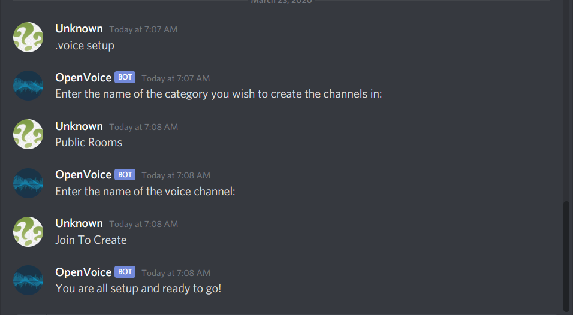

# VoiceCreateBot


## Commands 
- setup: Sets the bot up in the server
- remove: Removes all the channels and category this bot manages
- cleanup: Deletes empty channels that were created in the bots category and any channel that wasn't created by the bot





4. The discord token is loaded in from a config file. You will need to create this file. Create a file named **discord.ini**. That file should have the following format:
```
[discord]
token = 

```
To the right of the equals sign put your token.

